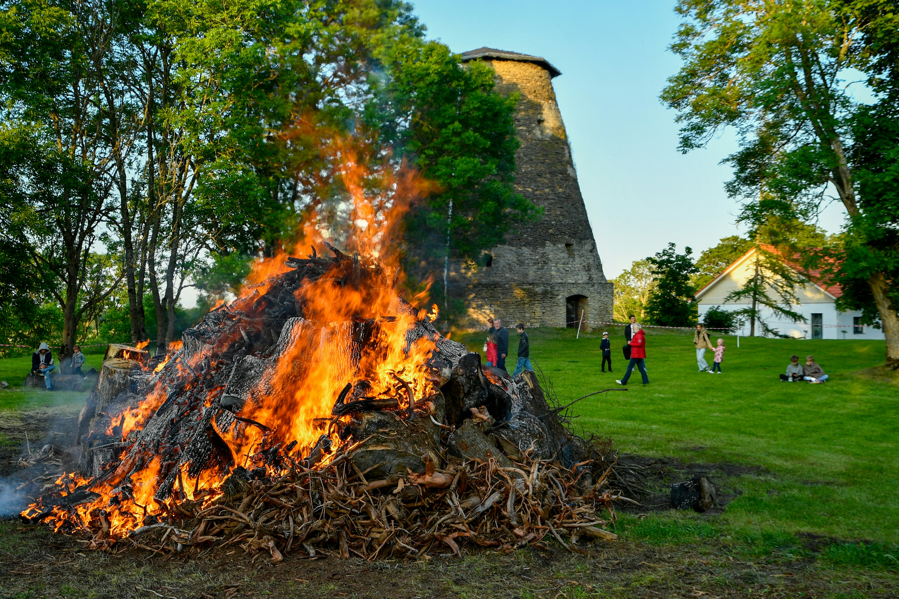
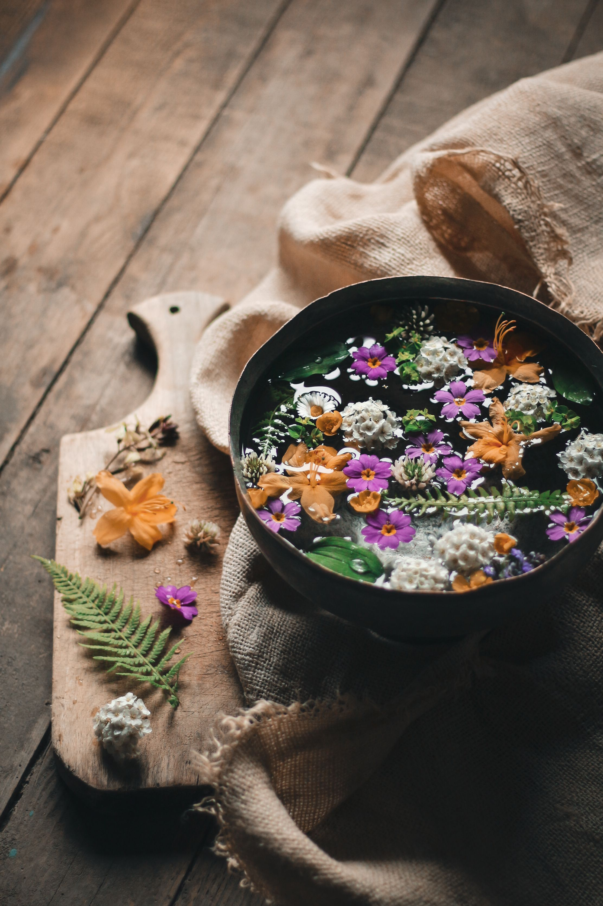

# **Il Solstizio d'Estate: nonne, Litha e la Notte di San Giovanni**

Nella mia terra, la Sardegna, nella notte magica del Solstizio d’Estate le persone si tenevano per mano e saltavano il falò per tre volte, sancendo così il legame di "comare" e "compare": un rapporto di vicinanza spirituale in grado di durare per tutta la vita. 

Il rituale prevedeva che si spezzasse un fazzoletto in due di fronte ai fuochi, e ogni donna conservava la propria metà come simbolo del legame.

*"Mi commuove molto parlarne perché le mie nonne, nel mio paese, Galtellì, sono diventate comari proprio in questo modo. Si diceva che diventare comari nella notte di San Giovanni sancisse persino una promessa di matrimonio tra i futuri figli che avresti avuto. Beh, a casa mia è successo proprio così!"*

## Il Solstizio d'estate

Quando la luce raggiunge il suo culmine, la natura ci invita a fermarci e a celebrare. 

Il significato spirituale del Solstizio d'Estate, di Litha e della notte di San Giovanni racconta un'antica visione del mondo, in cui l'essere umano si riconosceva come parte integrante dei cicli della Terra e delle stagioni. Come potremmo vivere meglio, se in ogni fase dell’anno ci rispecchiassimo nei ritmi della natura?

È probabile che tu abbia già sentito parlare del Solstizio d'Estate. Molto spesso, a scuola, ci viene spiegato semplicemente come un fenomeno astronomico; ma raramente ci si sofferma sul suo significato simbolico e umano. Eppure, sentiamo un profondo bisogno di riconoscerci parte della Terra che abitiamo e dei suoi ritmi.

E se ti dicessi che esiste un modo diverso di guardare al susseguirsi delle stagioni? 

Un modo che ci permette di leggere, nell'anno che scorre come una spirale, qualcosa che parla intimamente anche di noi. L'umanità ha sempre celebrato riti di passaggio legati ai cicli naturali e alla spirale dell’anno. Attraverso questi momenti ci si ricordava di appartenere a una realtà più grande, fatta di trasformazioni, morte e rinascita.

In questo articolo ti accompagnerò alla scoperta del Solstizio d'Estate, di Litha e della notte di San Giovanni, osservandoli non solo come tradizioni del passato, ma come occasioni per ritrovare un dialogo profondo con la natura. In questo blog troverai inoltre altri articoli dedicati ai diversi momenti della Ruota dell'Anno.

## **La Ruota dell'Anno e il Solstizio d'Estate**

### **La Spirale dell'Anno: un tempo ciclico**

Ogni passaggio della Ruota dell’anno (che amo chiamare anche *la spirale*) contiene contemporaneamente un inizio e una fine, e il suo significato spirituale arriva da lontano. Nel momento di massima luce è già presente il seme dell'oscurità futura e, allo stesso modo, nel momento di massimo buio (il Solstizio d’Inverno) è già custodita la luce che verrà. 

Tutto riflette il principio della ciclicità, lo stesso che guida la vita e la Luna: nascita e morte, crescita e declino si susseguono in una spirale infinita.

### **Gli otto sabba della tradizione pagana**

Per i Celti, che a loro volta hanno custodito spiritualità ancora più antiche, la Ruota dell’anno comprende otto festività (chiamate *sabba*):

* **Quattro maggiori:** Samhain, Imbolc, Beltane e Lammas, legati principalmente ai cicli agricoli.
* **Quattro minori:** i due solstizi e i due equinozi.

### **Litha: la festa di Mezza Estate**

Il Solstizio d'Estate (Litha per la tradizione pagana, San Giovanni per quella cristiana) si celebra tra il 20 e il 23 giugno. Alla nostra latitudine segna l’inizio dell’estate, mentre per i Celti la bella stagione non cominciava con il solstizio, ma con Beltane (il 1° maggio); per loro, quindi, Litha rappresentava la mezza estate (*Midsummer*).

## **Il significato simbolico del Solstizio d'Estate**

La festa di San Giovanni ha in realtà origini antichissime: il suo significato si perde nella notte dei tempi e si intreccia profondamente con le celebrazioni e i rituali legati al Solstizio d’Estate. In molte parti del mondo esistono siti megalitici costruiti per misurare e onorare i fenomeni solari, e ne possiamo trovare moltissimi anche in Italia. 

Ogni gesto quotidiano era un rito propiziatorio. Per quanto oggi crediamo di vivere in un’era "avanzata", a differenza dei nostri avi abbiamo perso il contatto intimo con i cicli della Terra e della vita.

Prova a chiudere gli occhi e a immaginare una notte importante come il Solstizio d’Estate di 3000 anni fa: capirai come questa ricorrenza assumesse un significato vitale per diverse culture del mondo. Il Sole non era una semplice "buona notizia meteorologica", ma il motore stesso dell'esistenza. La sopravvivenza della comunità dipendeva in maniera visibile e tangibile dai ritmi naturali; per questo la Grande Madre era considerata sacra, totalmente intrecciata alla vita quotidiana e alla spiritualità umana. 

### **Quando il Sole si ferma nel cielo**

L’apparente stato di immobilità del Sole rispetto al punto di vista terrestre veniva chiamato in epoca romana *Sol Status* (da cui "solstizio"). Il Sole raggiunge il suo zenit segnando l'inizio di una nuova stagione nell'Emisfero Boreale ma, contemporaneamente, dà il via alla sua lenta discesa. L'essenza di questo istante – di questi tre giorni di massima potenza solare – si lega alla celebrazione di Madre Natura: Gaia, Gea, Tanit... a seconda della tradizione che senti più tua.

### **Celebrare l’abbondanza della Terra**

Nel giorno del solstizio, le energie ci invitano a celebrare la potenza del Sole e l'abbondanza della Terra che, da millenni, continua a donarci i suoi frutti maturi. Madre Terra ci ricompensa degli sforzi affrontati durante l'intero inverno, sia sul piano simbolico sia su quello materiale, invitandoci a raccogliere ciò che abbiamo seminato.

## **Fuoco e Acqua: le energie di Litha**

*\[Inserisci qui l'immagine: falò, erbe, acqua, dettaglio naturale]*

Litha è contemporaneamente due cose:

* Una festa del fuoco
* Una festa dell'acqua

I rituali del Solstizio d’Estate nella tradizione pagana sono tantissimi e cambiano da regione a regione, ma quasi sempre i due elementi protagonisti sono il fuoco (simbolo solare e maschile) e l’acqua (simbolo lunare e femminile). Ancora una volta veniamo invitate e invitati a non dividere, ma a unire le polarità opposte.

### **IL fuoco del Sole e della vitalità**

Si narrava che i fuochi allontanassero la sfortuna e risvegliassero l’ardore nel cuore; inoltre, offrire gratitudine al fuoco per la sua presenza vitale era un modo per propiziare raccolti più abbondanti. Il fuoco rappresentava il Sole, la vitalità e la manifestazione. 

### **L’acqua e la purificazione**

L’acqua, elemento opposto e complementare al fuoco, si manifesta nella notte che precede il solstizio attraverso la rugiada. Essa ci permette di assorbire la magia dell'alba e di accogliere un profondo potere purificatore; per questo un tempo erano così diffusi i bagni rituali in fonti e sorgenti.

## **L'Acqua di San Giovanni: tradizione e preparazione**

### **Cos’è la Guazza di San Giovanni**

*"La guazza di santo Gioanno fa guarì da ogni malanno"*

Ed eccoci alla meravigliosa *guazza* di San Giovanni e al suo significato. Se ti stai chiedendo come preparare l’Acqua di San Giovanni leggi sotto, perchè secondo la tradizione basta una ciotola riempita con acqua di fonte o di sorgente (io userò quella di una fontana che scorre in un parco vicino a casa). Raccogli fiori ed erbe spontanee e disponili delicatamente sulla superficie.

### **Come prepararla**

Se vuoi, puoi preparare la tua guazza seguendo questi semplici passi:

1. **La sera del 23 giugno**, procurati una ciotola contenente acqua di fonte, fiori ed erbe spontanee (come iperico, lavanda, menta, rosmarino, camomilla). Lasciala all'aperto per tutta la notte, esposta alla rugiada e alla luce della Luna.
2. **La mattina del 24 giugno**, filtra l'acqua e usala per un lavaggio rituale di purificazione e benedizione.

Tradizionalmente, quest'acqua veniva usata dalle donne per lavare il viso e dagli uomini per bagnare le mani. È considerata portatrice di benessere, fertilità, radianza e protezione (si diceva persino che la rugiada potesse propiziare la nascita di figli belli e sani).

Prepara la tua guazza e immergiti anche tu nella spirale dell’anno. Forse non torneremo a vivere esattamente come gli antichi, ma sicuramente avremo dedicato un tempo lento a noi stesse, regalandoci una connessione autentica con questa potente fase dell’anno.

Se ami questi temi, nella mia newsletter condivido riflessioni, consigli naturopatici e ritualità e contenuti dedicati alla Spirale dell’Anno e al vivere in sintonia con i ritmi della natura. 

**[Clicca qui per iscriverti ](https://martazola.it/newsletter/)**
