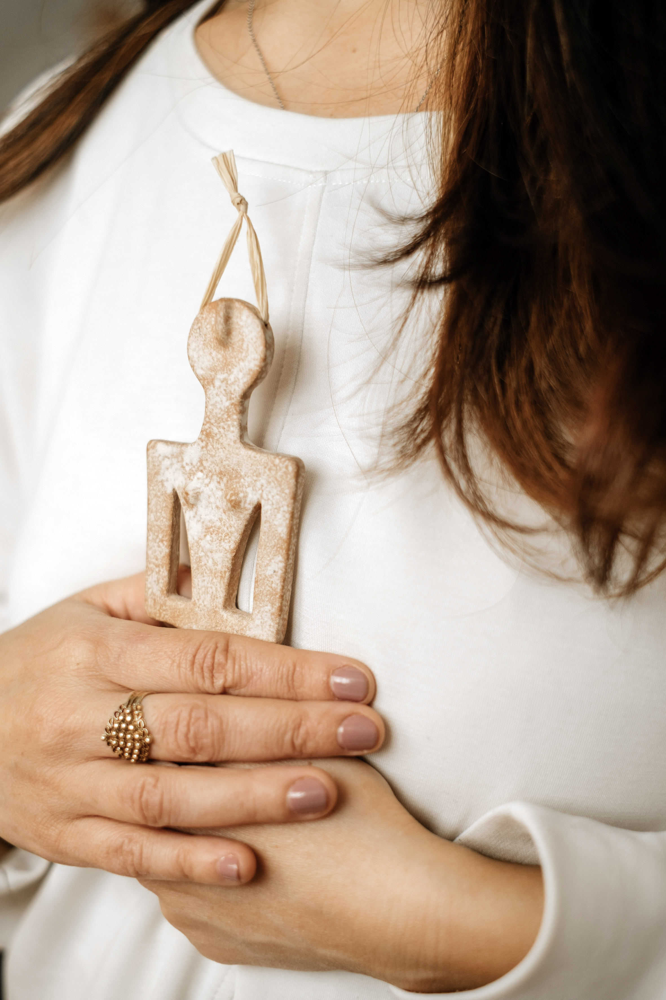
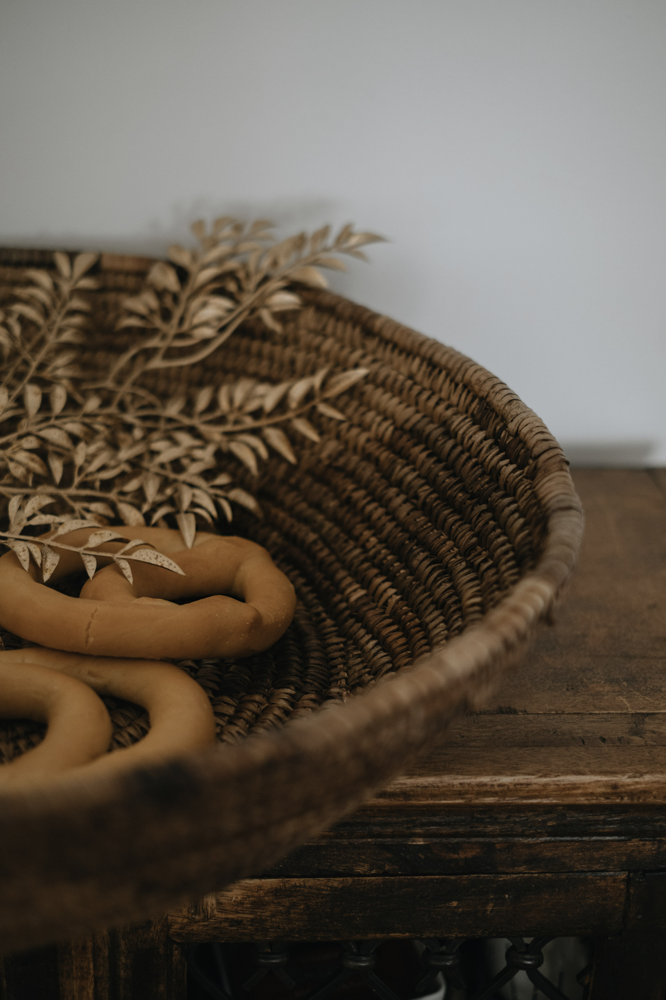
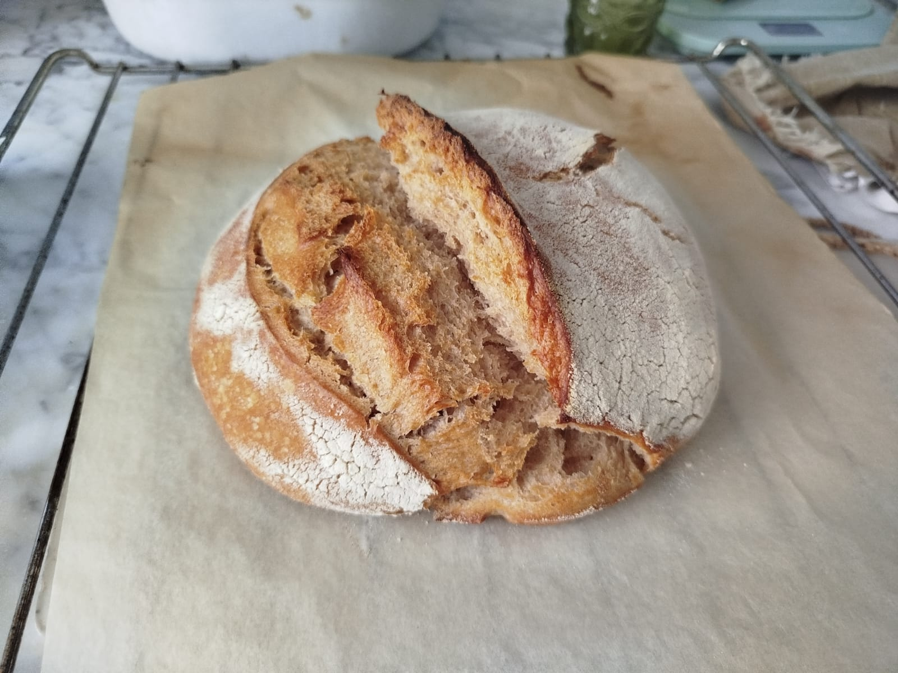

Quando il **calore dell’estate** ci mette alla prova raggiungendo il suo culmine, la terra si tinge di oro e **la natura ci invita a compiere un gesto antico:** raccogliere ciò che abbiamo coltivato e **celebrare**, ma **anche accettare ciò che non è arrivato** secondo le nostre aspettative. 

Il significato spirituale di **Lammas e Lughnasadh** ci racconta di un profondo legame tra l’essere umano e la Terra. Un tempo in cui la spiritualità aveva il volto femminile della **Grande Madre** e la sacralità dei cicli della vita **(vita, morte, rinascita) era ovunque.** Come cambierebbe la nostra quotidianità se imparassimo ad ascoltare e a rispettare i tempi del nostro personale raccolto?

È probabile che tu conosca l**a festa di Ferragosto,** ma forse raramente ti sei soffermata sulle sue radici più antiche e **sul significato simbolico di questo momento dell’anno.**  Eppure, sentiamo tutte un bisogno viscerale di ritrovare un contatto autentico con i ritmi della Natura, che io amo chiamare la Spirale dell’anno. 

**In questo articolo ti accompagnerò alla scoperta di Lammas o Lughnasadh,** non solo come antiche tradizioni, ma come un’opportunità per fare un bilancio interiore, coltivare la gratitudine e allinearci con la spirale dell’anno. 

## **La Ruota dell’Anno e Lughnasadh: significato spirituale del raccolto.**

### **La Spirale dell’Anno: un tempo ciclico**

Ogni passaggio della **Ruota dell’Anno (o spirale) racchiude in sé il mistero della ciclicità.** Dopo il massimo splendore estivo il Sole comincia lentamente a calare e la notte riprende spazio. **Tutto ci parla di questo principio eterno:** nascita, crescita, culmine, trasformazione, decrescita e riposo.

**Comprendere il tempo circolare può regalarci una profonda sensazione di pace:** ci ricorda che c’è **un tempo per seminare e uno per raccogliere, uno per la fatica e uno per il meritato riposo** in ogni fase della nostra vita, sia esso annuale che esistenziale. 

### **I tre momenti del raccolto secondo le tradizioni contadine**

Nella tradizione, il tempo del raccolto non si esaurisce in una giornata lavorativa o durante tutto l’anno, ma si snoda attraverso tre grandi tappe:

* **Lammas / Lughnasadh (1° Agosto):** la prima festa del raccolto, la mietitura e la celebrazione del grano e dei primi frutti.
* **Mabon / Equinozio d’Autunno (21 Settembre):** il secondo raccolto, il momento dell’equilibrio e della vendemmia.

**Samhain (31 Ottobre):** il terzo e ultimo raccolto, il passaggio verso la stagione scura e il riposo fisiologico che la natura ci chiede.

### **Lammas o Lughnasadh: le origini del nome**

Collocata **tra il 31 luglio e i primi giorni di agosto**, questa ricorrenza porta con sé due anime:

* **Lughnasadh:** di origine celtica, prende il nome dal Dio del fuoco e della luce, Lugh, e celebra la sacralità della terra madre fecondata e il sacrificio del re del grano.
* **Lammas:** nome di origine sassone (da *Loaf-mass*, ovvero “Messa delle Pagnotte”) nato con la cristianizzazione per indicare la benedizione del primo pane sfornato dal nuovo raccolto.

## **Il significato simbolico e spirituale del raccolto.**

A metà strada tra il [Solstizio d’Estate](https://martazola.it/blog/2026-06-17-il-solstizio-destate-nonne-litha-e-la-notte-di-san-giovanni/) e l’Equinozio d'Autunno, Lammas segna la maturazione massima dei cereali e la seconda metà della bella stagione, in particolare alla nostra latitudine. 

**Ma come possiamo vivere questo momento a livello interiore?**

**Il Mistero del Grano: Vita, Morte e Rinascita**

**Fin dal Paleolitico, il grano e i cereali erano considerati sacri.** Proviamo per un attimo a connetterci con **la magia della maturazione dei cereali e al significato nutritivo del pane** nei tempi, perché il grano racchiude in sé il mistero della vita e del nutrimento. 

Inoltre **quando la falce lo taglia viene svolto un sacrificio necessario,** in quanto lo stelo muore affinché la spiga possa diventare farina e pane, portando vita e sopravvivenza.

Questa trasformazione alchemica ci ricorda il **ciclo di vita, morte e rinascita** e che per far entrare il nuovo è necessario portare a maturazione e poi saper lasciare andare ciò che ha terminato il suo ciclo, oppure lasciar andare ciò che non è più necessario. 

### **Coltivare la gratitudine e l’accettazione**

Lammas è il momento massimo in cui è il tempo di osservare il cesto che abbiamo fra le mani e **riconoscere i frutti del nostro lavoro, delle nostre scelte e del nostro impegno.** 

E se quest'anno la tua terra ha prodotto solo erbacce? Imparare ad **accettare un raccolto scarso** e **fare un bilancio interiore** è il primo passo **per per perdonarsi e ripartire.** Anche se non è arrivato ciò che avevamo immaginato, non siamo le stesse persone di un anno fa. Abbiamo raccolto degli insegnamenti e **ciò che conta è che ne osserviamo veramente i frutti.** 

Per esempio lavorando sui nostri pattern mentali, sulle nostre modalità che si ripetono e non ci permettono di essere chi vogliamo. 

* **Prova a scrivere in un foglio una situazione che hai rivissuto quest’anno che è identica ad altre che hai già affrontato e di cui non sei per niente contenta.** 
* **Quale parola di arriva per descrivere come stai rispetto a questa cosa?** 
* **Prova a scriverla in un foglio e vedere che effetto ti fa vederla scritta in grande. Stai lì, prova a stare con questa cosa.** 

Questo è **il momento perfetto per spogliarci dell'insoddisfazione o godere della bellezza** di ciò che siamo riuscite a realizzare nel nostro piccolo e celebrare con umiltà e gioia l'abbondanza che ci circonda, **perché la bellezza a livello naturale, non manca mai.** 

## **Rituale del pane fatto in casa: come celebrare Lammas anche in appartamento.**

**Un rituale di gratitudine semplice per celebrare Lammas a casa, anche se vivi in un appartamento.** 

**Come funziona:**

1. **Se fai il pane preparalo oppure compra il tuo pane preferito.** 
2. **L'intenzione è ciò che conta:** prima di infornare o spezzare il pane comprato incidi un simbolo di gratitudine, una croce o una spirale, quello che preferisci. Ad ogni taglio o gesto, pronuncia ad alta voce o interiormente una cosa specifica per cui sei grata dell'anno trascorso.
3. **Restituzione:** Prima di mangiare la prima fetta, staccane un pezzetto e offrilo lasciandolo all'aperto (su un balcone, sotto un albero o in un vaso di fiori) come ringraziamento alla Terra.
4. **La condivisione:** Il resto del pane viene spezzato *rigorosamente con le mani* e mangiato con una nuova consapevolezza. 

Questo direi che rientra nei **riti di gratitudine semplici,** ma potentissimi, per la festa del raccolto.

Forse **non torneremo a vivere esattamente come gli antichi,** ma sicuramente avremo dedicato **un tempo lento a noi stesse,** regalandoci una connessione autentica con questa potente fase dell’anno.

**Se ami questi temi,** nella mia **[newsletter](https://martazola.it/newsletter/)** condivido riflessioni, consigli naturopatici, ritualità e contenuti dedicati alla Ruota dell’Anno. 

### [Clicca qui per iscriverti.](https://martazola.it/newsletter/)

Testo e contenuti © 2026 @martazola. Tutti i diritti riservati.
